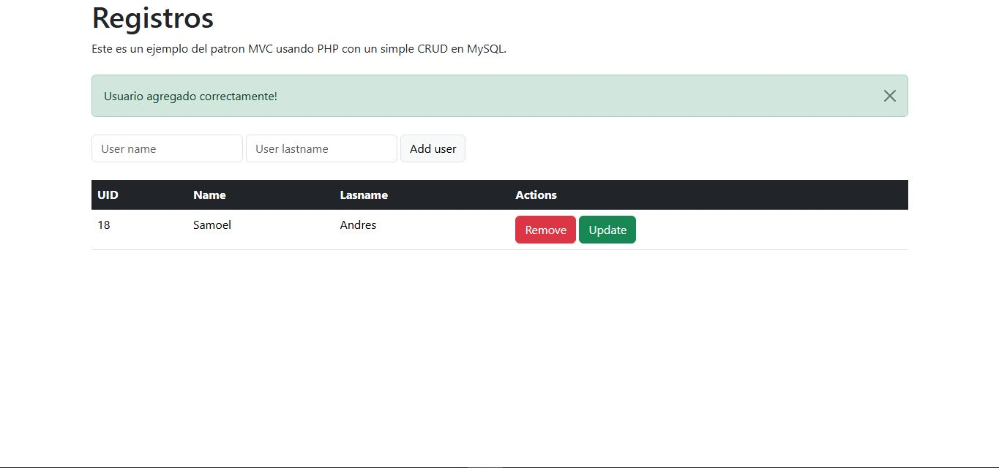

# Práctica MVC PHP

<br><br><br>

Este proyecto es una implementación sencilla del patrón de diseño **MVC** (Modelo-Vista-Controlador) usando **PHP**. El propósito es entender y aplicar este patrón en un proyecto web básico, organizado de forma modular para manejar solicitudes HTTP, procesamiento de datos y presentación de la interfaz de usuario.

## Descripción

El proyecto muestra cómo estructurar una aplicación web utilizando el patrón **MVC** en PHP. Con este enfoque, el código se divide en tres componentes principales:

- **Modelo (Model)**: Es la parte encargada de la lógica de datos. Aquí se manejan las interacciones con la base de datos y la manipulación de la información.
- **Vista (View)**: Se encarga de mostrar la información al usuario. Las vistas son archivos HTML que pueden contener datos dinámicos proporcionados por el controlador.
- **Controlador (Controller)**: Actúa como intermediario entre el Modelo y la Vista. Recibe las solicitudes del usuario, manipula los datos mediante el Modelo, y luego actualiza la Vista.



## Características

- Implementación del patrón de diseño **MVC**.
- Separación clara de responsabilidades entre el Modelo, la Vista y el Controlador.
- Soporte para rutas dinámicas a través de URL.
- Uso de **PHP** para la parte lógica de la aplicación.
- Estructura modular y extensible.

## Requisitos

- **PHP** 7.4 o superior.
- Un servidor web como **Apache** o **Nginx**.
- Base de datos (si se utiliza, puedes configurar MySQL u otro sistema de base de datos).

## Instalación

Para usar este proyecto, sigue estos pasos:

1. Clona el repositorio:

   ```bash
   git clone https://github.com/samoel-andres/practica_mvc_php.git
   ```

2. Navega a la carpeta del proyecto:

   ```bash
   cd practica_mvc_php
   ```

3. Configura tu servidor web para que apunte al directorio del proyecto, asegurándote de que la configuración del **DocumentRoot** esté correcta (si usas Apache, por ejemplo).

4. Si estás utilizando una base de datos, configura el archivo de conexión en el **Modelo** con los detalles correctos (host, usuario, contraseña, nombre de la base de datos).

5. Abre el proyecto en tu navegador visitando la URL configurada (por ejemplo, `http://localhost/practica_mvc_php/`).

## Uso

Una vez que el servidor esté en funcionamiento, puedes acceder a las diferentes rutas de la aplicación. El controlador correspondiente se encargará de manejar la solicitud y presentar la vista adecuada. Las rutas son gestionadas por el controlador principal.

## Estructura del Proyecto

La estructura del proyecto es la siguiente:

```
practica_mvc_php/
│
├── app/                # Lógica principal del proyecto
│   ├── controllers/    # Controladores
│   ├── models/         # Modelos (lógica de datos)
│   └── views/          # Vistas (HTML)
│
├── .gitignore          # Archivos a ignorar por Git
└── README.md           # Este archivo
```

- **app/controllers**: Contiene los archivos de los controladores que manejan las solicitudes.
- **app/models**: Contiene los modelos que se comunican con la base de datos.
- **app/views**: Contiene las vistas en HTML que se presentan al usuario.
